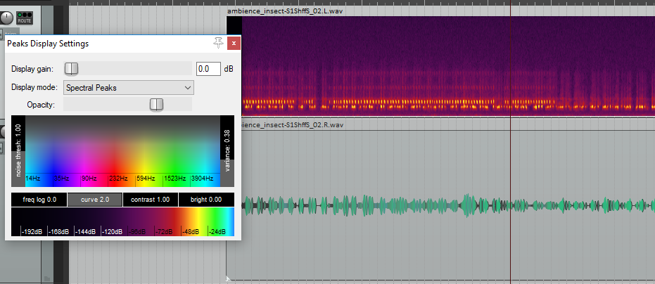

# LVGL_Audio_FFT_Spectrum

I use M5StickC-Plus in this demo, it has a built-in MEMS microphone and an LCD display with a resolution of 240x135.

Use [LovyanGFX](https://github.com/lovyan03/LovyanGFX) as(or like) backend driver for [lvgl](https://github.com/lvgl/lvgl), it is very simple to use, you only need to port one method.

```C
static void my_disp_flush(lv_disp_drv_t *disp, const lv_area_t *area,
                          lv_color_t *color_p) {
    int w = (area->x2 - area->x1 + 1);
    int h = (area->y2 - area->y1 + 1);

    /* Start new TFT transaction */
    lcd.startWrite();
    /* set the working window */
    lcd.setAddrWindow(area->x1, area->y1, w, h);

    /* Write the buffer to the display */
    lcd.writePixels((lgfx::rgb565_t *)&color_p->full, w * h);

    /* terminate TFT transaction */
    lcd.endWrite();
    /* tell lvgl that flushing is done */
    lv_disp_flush_ready(disp);
}
```

### reference

1. [m5stack-core2-audio-monitor](https://github.com/atomic14/m5stack-core2-audio-monitor)

    Thanks atomic14's awesome demo, The code for audio and FFT processing is referenced from this project.

2. [lv_demo_music](https://github.com/lvgl/lv_demos/tree/master/src/lv_demo_music)
   
   Spectrum graphics drawing method reference this demo.

3. [mapping sound to color](https://designingsound.org/2017/12/20/mapping-sound-to-color/)

    The color map refer to this article and this image.
    